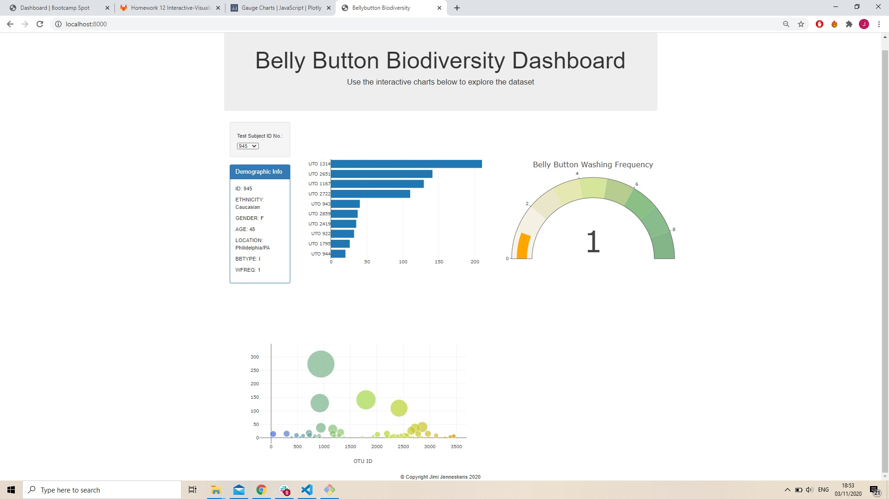

# Interactive Visualization
## Contributor
* Jimi Jenneskens

---
Table of contents 

1. [Interactive Visualization](#1)

---

### Interactive Visualization 
#### Interactive dashboard
[Go back to the table of contents](#toc)

##### Files

* index.html -- Belly Button Biodiversity dashboard.
* app.js -- JavaScript for index.html webpage functionality.
* data/samples.json -- Sample values used as input for the graphics in the dashboard.

##### Screenshot dashboard

